# Kanály

## Regionálne
Vrámci slovenského MeshCore máme zopár regionálnych kanálov.
Prosím vždy sa snažte používat **Region scope**, aby sa správy nedostávali do celej siete(vrátane Madarska a Rakúska)

| Názov kanálu | Region Scope | Popis |
| ------------ | ------------ | ----- |
| #bratislava | sk-ba | okolie Bratislavy |
| #kosice | sk-ke | okolie Košíc |
| #poprad | sk-pp | okolie Popradu |
| #prievidza | sk-pd | okolie Prievidze |
| #turiec | sk-mt | okolie Martina, Turan a Vrútok |
| #zilina | sk-za | okolie Žiliny |
| #zvolen | sk-zv | okolie Zvolena |

## Ako pridať kanál
1. Kliknite na kontextové menu **⋮** vpravo hore
 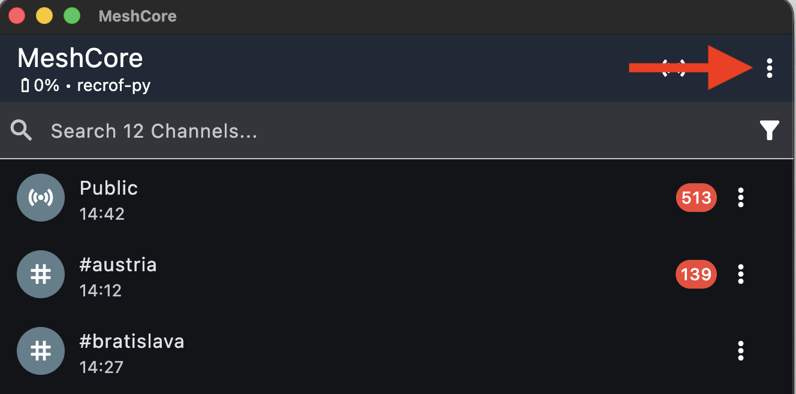

2. Vyberte **Add Channel** / **Pridať kanál**
 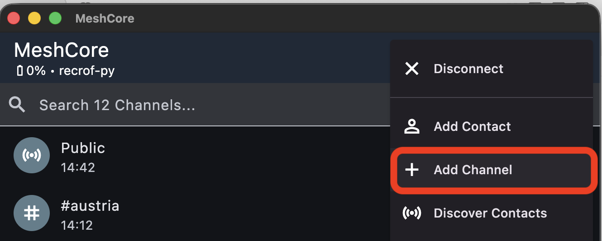

3. Vyberte **Join Hashtag Channel** / **Pripojiť sa k hashtagovému kanálu**
 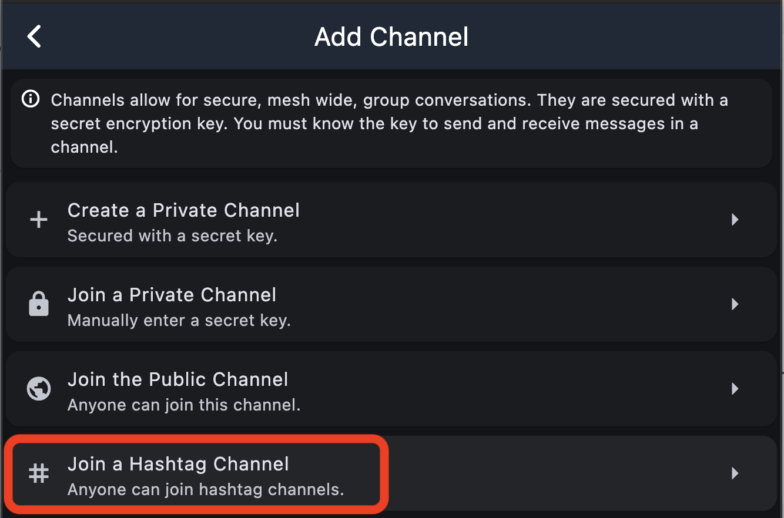

4. Do políčka napíšte názov kanála a potvrdte
   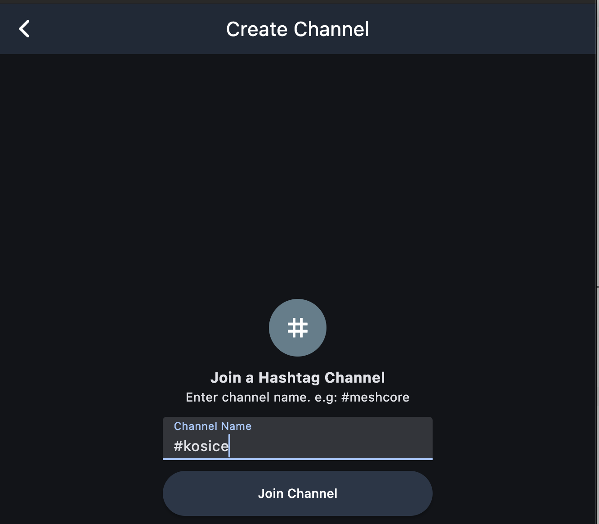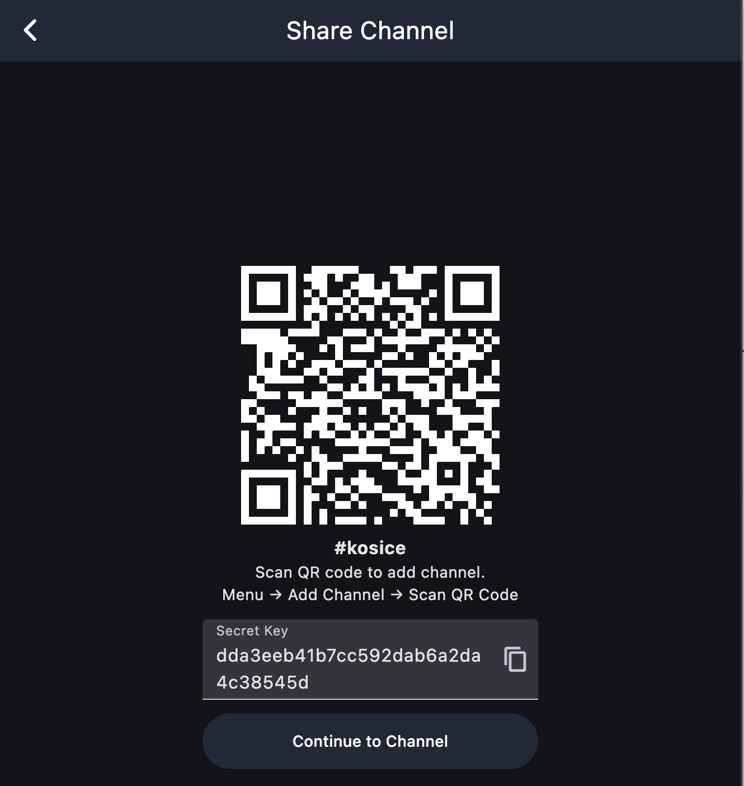

## Ako pridať a nastaviť región
1. Otvorte si kanál ktorému chcete priradiť región a vyberte kontextové menu vpravo hore
 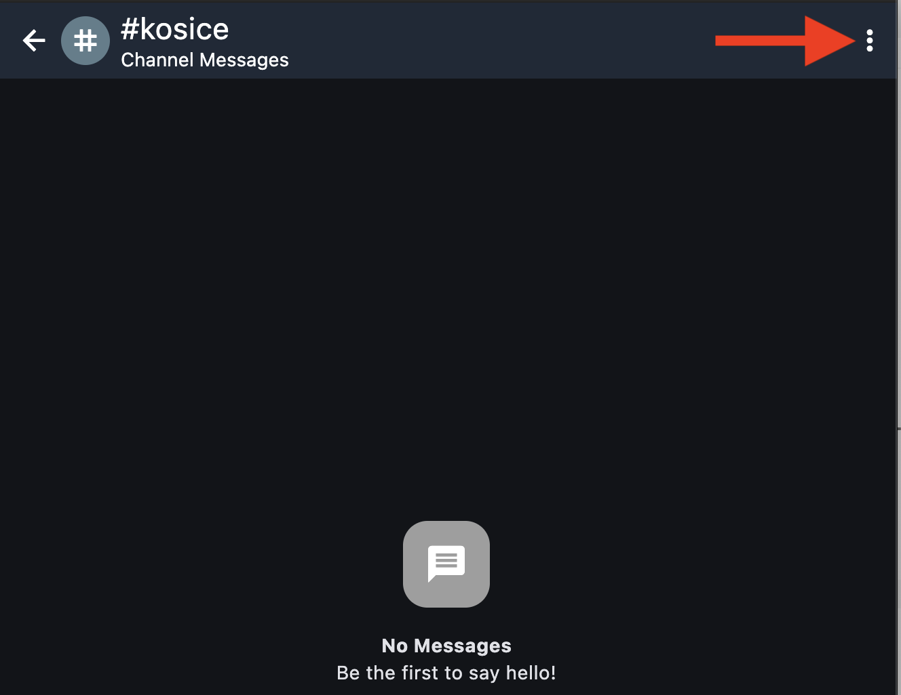

2. Vyberte **Set Region Scope** / **Nastaviť rozsah regiónu**
 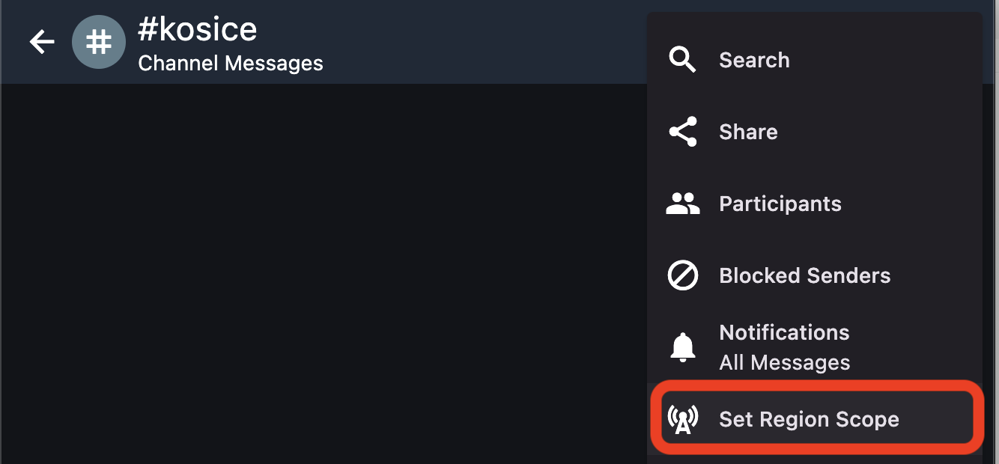

3. Kliknite na tlačidlo **+**
 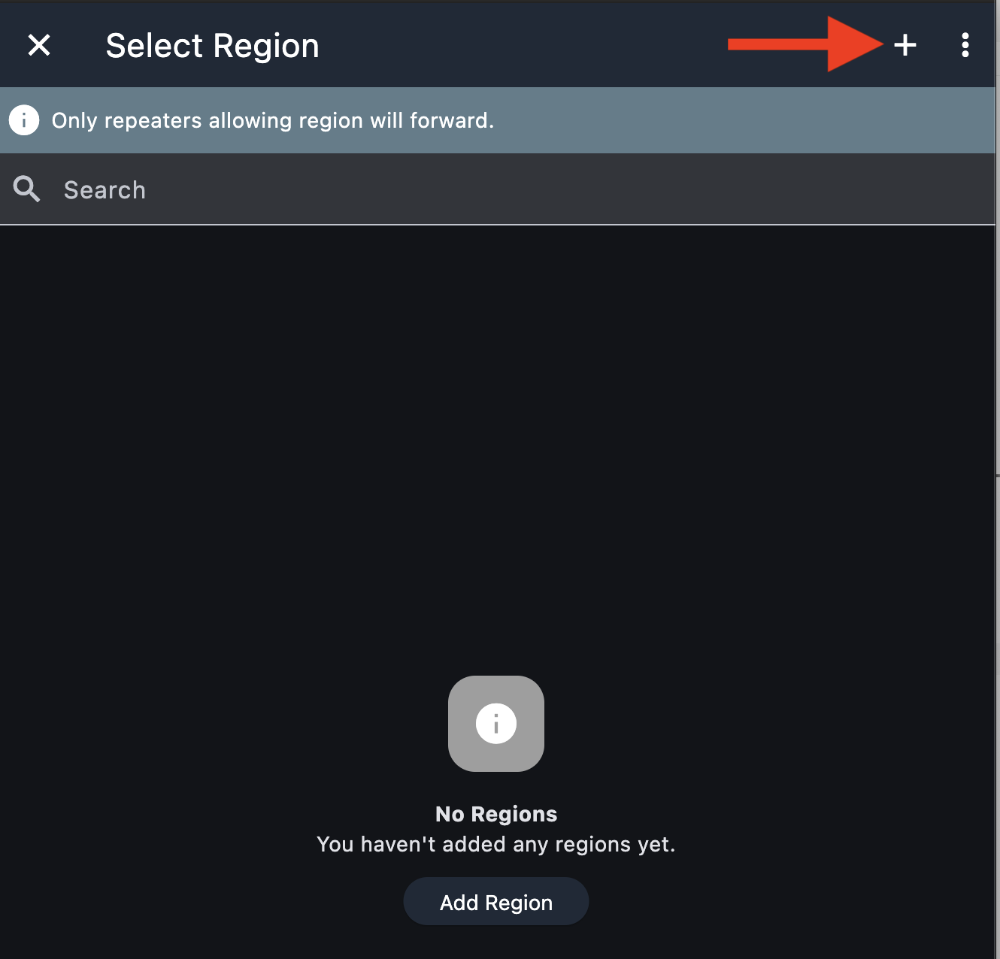

4. Do políčka napíšte názov regiónu a potvrdte **✓** vpravo hore
 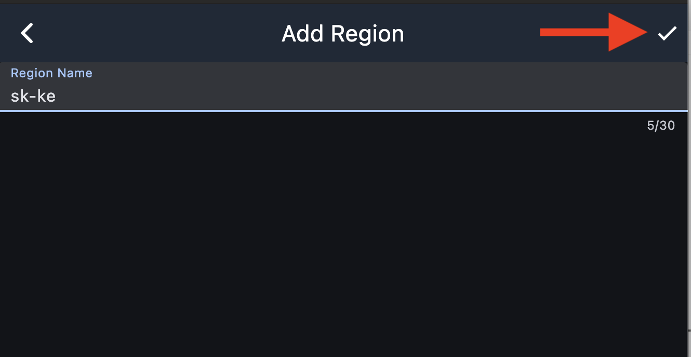

5. Vyberte región
 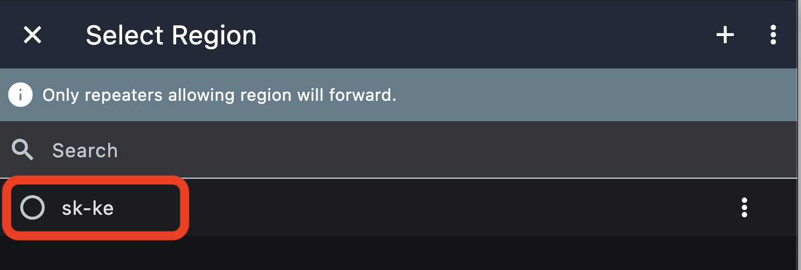

6. Skontrolujte vybraný región v hlavičke kanála
 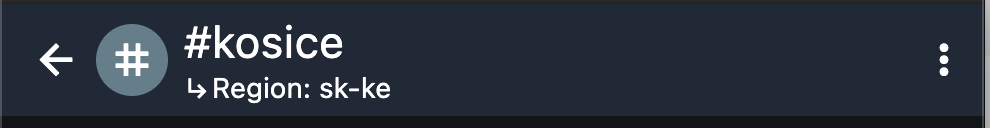
