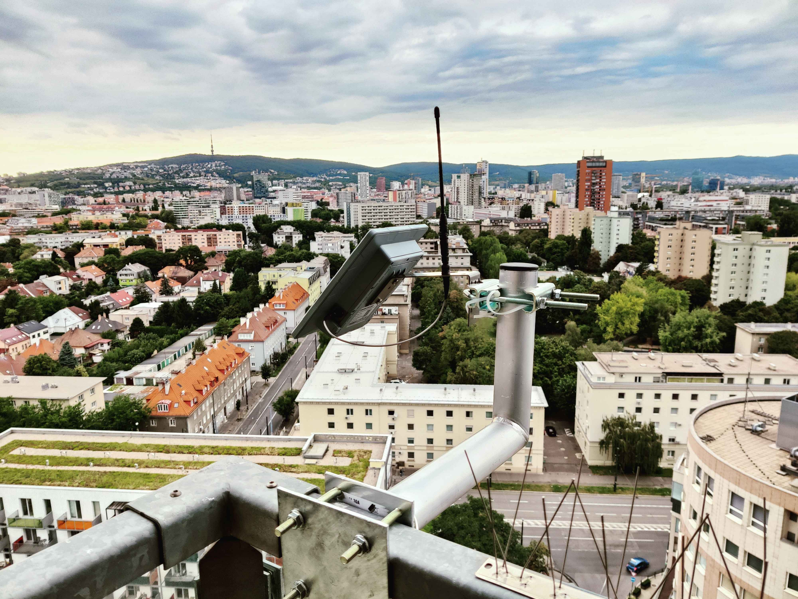
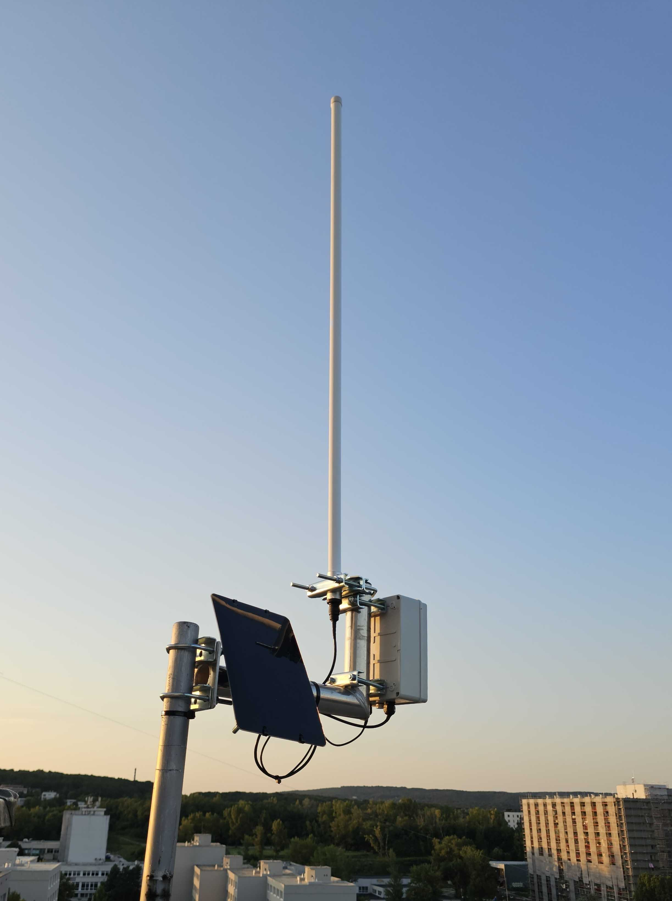
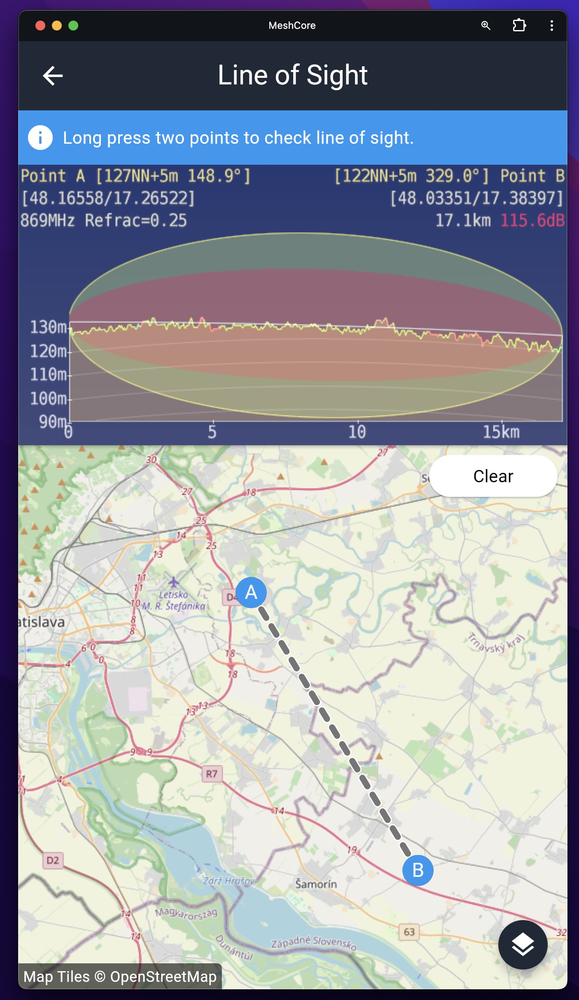
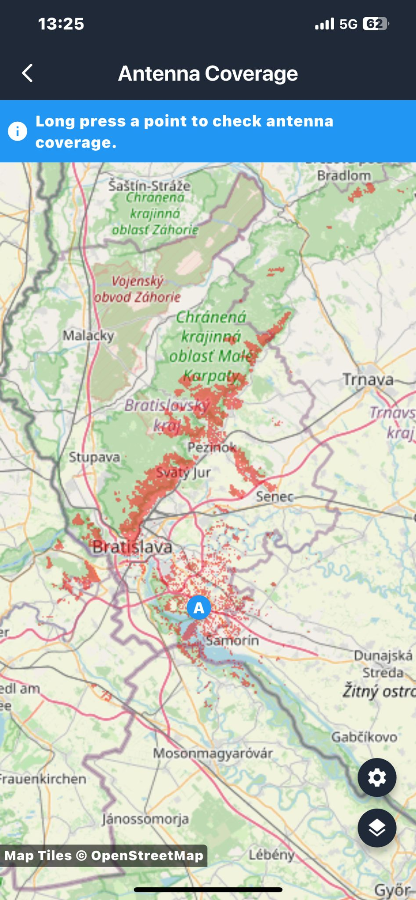
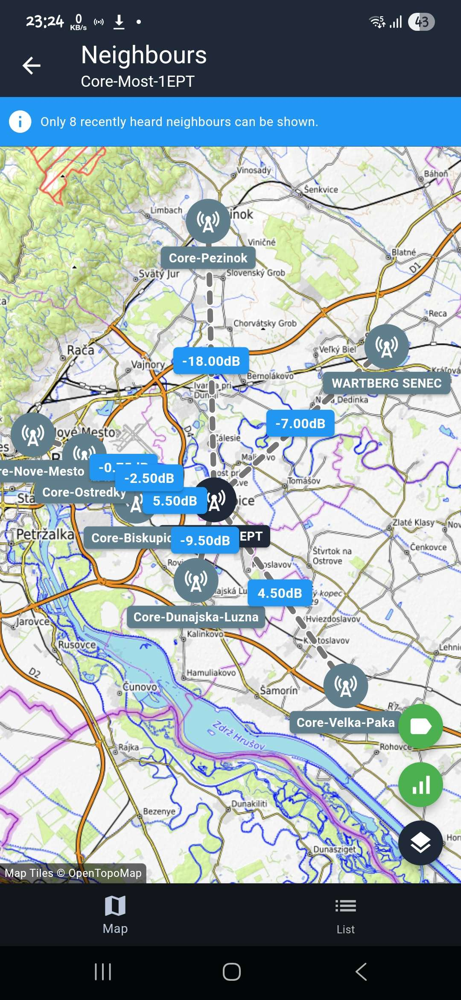

# Hardware
## ☀️ Solárne Repeatery

💡 Ak má mať mesh sieť v meste dlhodobý zmysel, treba sa zamerať na **energetickú efektivitu** a **odolnosť voči rušeniu**. Zariadenia s **nRF52** čipsetmi (RAK dosky alebo Seeed Xiao) majú nižšiu spotrebu a tým pádom vydržia dlhšie na solárnom napájaní. Pridaním kvalitného solárneho panelu, dostatočnej batérie a dobrej antény získame repeater, ktorý funguje stabilne aj v zimných mesiacoch (kompletne bez potreby výmeny batérií).  

💡 Neodmysliteľnou súčasťou buildov sú **filtre** – bez nich bude v mestskom prostredí sieť zahltená rušením zo silných BTS alebo iných zariadení. SAW alebo cavity filtre na 868 MHz znižujú šum a umožnia, aby repeater prijímal a odosielal správy čisto. Rovnako dôležité je použiť anténu s vhodným ziskom a pred samotnou inštaláciou preveriť pásmo cez **SDR meranie**, aby bolo jasné, či lokalita nie je zahltená. Pri umiestnení blízko BTS je nutné anténu orientovať a filtrovať tak, aby sa navzájom nerušili.  

---

### 🔨 DIY Boxed Solar Build
- **Radio:** [AliExpress](https://www.aliexpress.com/item/1005006901039995.html)  
- **Solar Panel:** [Soshine 6V/6W](https://www.fotoextra.cz/soshine-mini-solar-panel-6v-6w.html)  
- **Battery:** [Li-Pol 10000 mAh](https://techfun.sk/produkt/li-pol-bateria-kablik-ochranny-obvod/?attribute_pa_bateria=1260110-10000-mah)  
- **Filter:** [SAW Filter 868 MHz](https://www.laskakit.cz/saw-filter-bpf-868mhz/)  
- **Box:** [Install box](https://www.gme.sk/v/1511573/u-01-18-instalacna-krabica)  
- **Cable Glands (2x):** [IP68](https://techfun.sk/produkt/prechodky-pre-kable-biele-rozne-velkosti-ip68/?attribute_pa_variant=m161-5)  
- **Self-vulcanizing tape:** [EMOS 19mm/10m](https://www.cbelektro.sk/izolacna-paska-samovulkanizacna-19mm-10m-cierna-emos-p264892)  
- **Antenna:** [MikroTik Omni 868 MHz 6.5 dBi](https://www.wellnet.sk/en/mikrotik-868_omni_antenna-lora--6-5dbi--824-960mhz/)  

---

### 📦 All-in-One SenseCAP Solar Build
- **Radio + Solar + Battery + Enclosure:** [Seeed SenseCAP P1 Pro](https://www.seeedstudio.com/SenseCAP-Solar-Node-P1-Pro-for-Meshtastic-LoRa-p-6412.html)  
- **Adapter RP-SMA to SMA:** [Golden Loch](https://www.gme.sk/v/1500900/golden-loch-sma-rpsma-z-rv-50r-redukcia)  
- **Filter:** [SAW Filter 868 MHz](https://www.laskakit.cz/saw-filter-bpf-868mhz/)  
- **Self-vulcanizing tape:** [EMOS 19mm/10m](https://www.cbelektro.sk/izolacna-paska-samovulkanizacna-19mm-10m-cierna-emos-p264892)  
- **Antenna:** [MikroTik Omni 868 MHz 6.5 dBi](https://www.wellnet.sk/en/mikrotik-868_omni_antenna-lora--6-5dbi--824-960mhz/)  

---

<table style="width:100%; border-collapse:collapse; text-align:center;">
  <tr>
    <td style="width:60%; padding:4px;">
      
    </td>
    <td style="width:40%; padding:4px;">
      
    </td>
  </tr>
  <tr>
    <td>SenseCAP Solar Node P1 (all-in-one Repeater)</td>
    <td>DiY Repeater</td>
  </tr>
</table>

---

# Konfigurácia
## Meno repeatra

V Slovenskom meshi máme jednoduché názvoslovie pre všetky repeatre:
`SK-{Okres}-{Nazov-Lokality}` kde `{Okres}` je dvojpismenny kód okresu(BA, BB, KE, PP...) a `{Nazov-Lokality}` moze byt čokolvek od Obce, názvu kopca, alebo iný jasný identifikátor lokality. Prosim nepoužívajte diakritiku, vzdy začnite po pomlčke velkým písmenom a nepoužívajte v názve medzery. 

Priklad: `SK-SC-Nova-Dedinka` alebo `SK-BS-Sitno`

Všetkym repeatrom prosím uvedte približnú polohu, aby sa dali jednoducho používat nástroje ako Neighbours alebo Map trace

## Kolízie ID

Pri prvom štarte repeatra sa často stane že sa vygeneruje ID(prvý bajt) verejného klúča, ktorý sa už v sieti používa. Routing bude daľej fungovať, avšak sťaží to presnú identifikáciu cesty, preto sa odporúča upraviť klúč, aby mal voľné ID. 
Tu je jednoduchý návod ako odstrániť ID kolíziu:
1. Pripojte repeater cez usb do počítača.
2. Navštívte https://map.mc868.hu/config/repeater-setup.html
3. Dajte connect serial a vyberte serial port, na ktorom je repeater
4. V sekcii "Private / Public Key" treba kliknúť na tlačítko `[Choose from table]` a vybrať voľné ID
5. Stlačiť `[Generate]`, počkať kým sa vygeneruje nový privátny kľúč
6. Stlačiť `[Save & Exit]` a potom `[Reboot]` v hornej sekcii "Info & Actions"
   
## Plánovanie – Pokrytie – Pomôcky

Okrem premerania zarušenia spektra nám pri plánovaní vhodného umiestnenia repeatera pomáhajú aj nástroje priamo v aplikácii (v podmenu **Tools**).  
Sú to:

- **Line of Sight** – výškogram medzi dvoma bodmi na mape – vidíte, či vám nezavadzia hora alebo iná prekážka.  
- **Map Coverage** – pokrytie priamou vlnou oblasti, kde si prajete mať repeater.  
- **Neighbors** (v menu repeatera) – ak už máte repeater, funkcia vám, ukáže susedné repeatre, ktoré váš repeater počuje, vrátane sily signálu(SNR). Noví susedia sa prdajú vtedy, ked váš repeater začuje od suseda priamy advert.

<table style="width:100%; border-collapse:collapse; text-align:center;">
  <tr>
    <td style="width:32%; padding:5px;">
      
    </td>
    <td style="width:32%; padding:5px;">
      
    </td>
    <td style="width:32%; padding:5px;">
      
    </td>
  </tr>
  <tr>
    <td>App: Line of Sight</td>
    <td>App: Antenna Coverage</td>
    <td>App: Neighbours</td>
  </tr>
</table>
