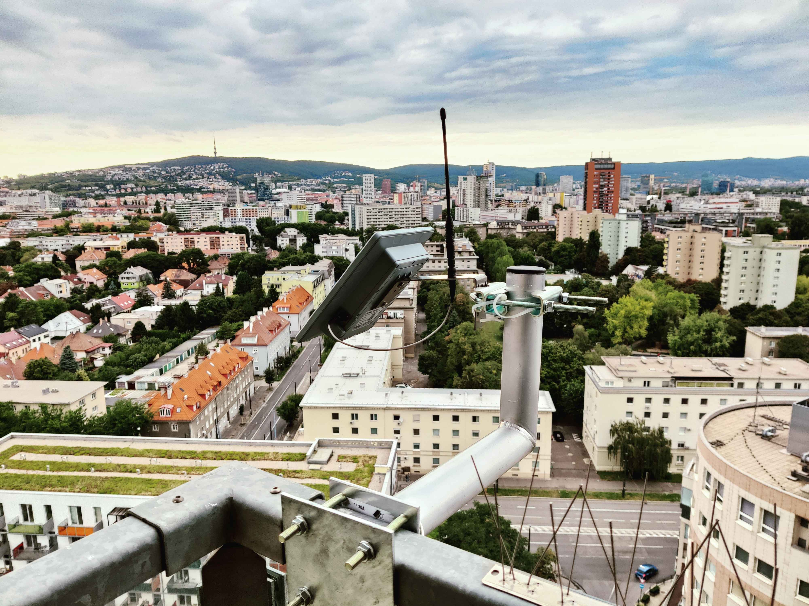
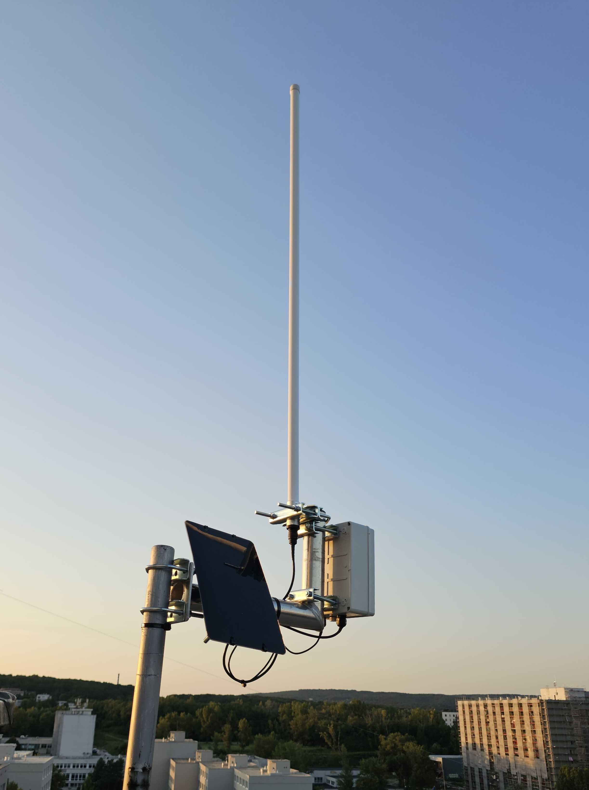
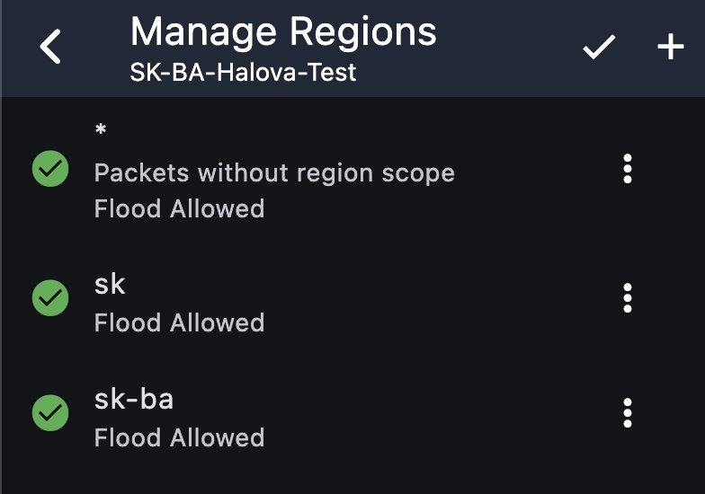
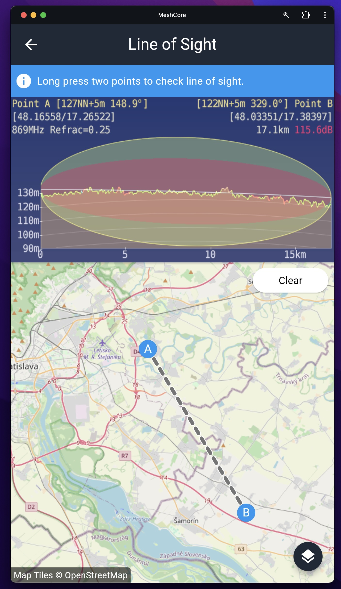
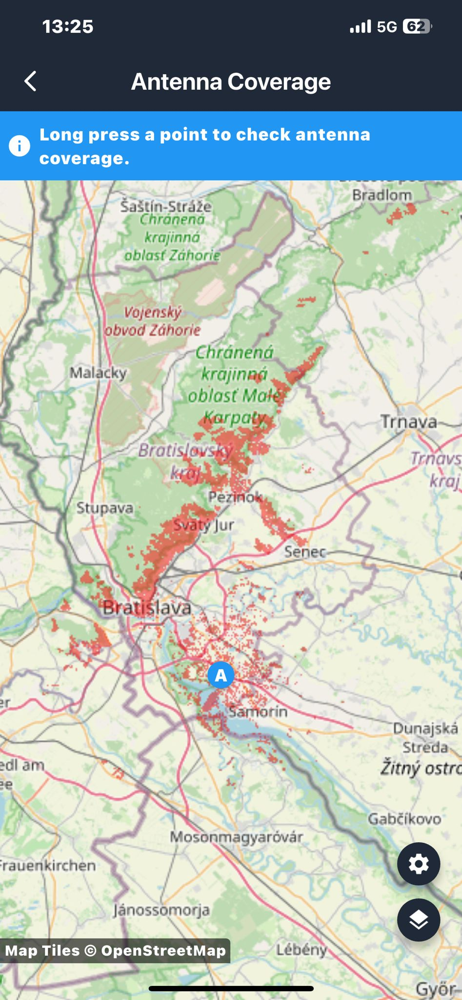
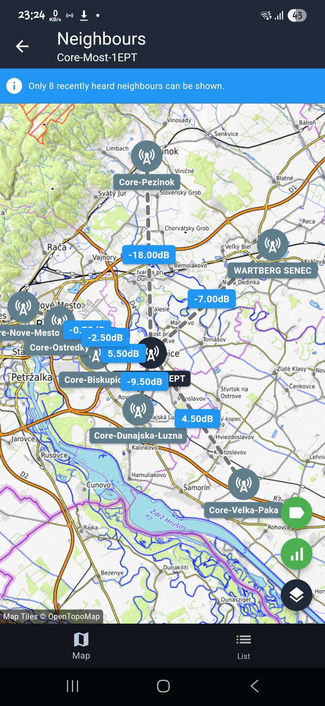

# Repeatre
## Stavba Repeatra - Hardware

Ak má mať mesh sieť v meste dlhodobý zmysel, treba sa zamerať na **energetickú efektivitu** a **odolnosť voči rušeniu**. Zariadenia s **nRF52** čipsetmi (RAK dosky alebo Seeed Xiao) majú nižšiu spotrebu a tým pádom vydržia dlhšie na solárnom napájaní. Pridaním kvalitného solárneho panelu, dostatočnej batérie a dobrej antény získame repeater, ktorý funguje stabilne aj v zimných mesiacoch (kompletne bez potreby výmeny batérií).  

Neodmysliteľnou súčasťou buildov sú **filtre** – bez nich bude v mestskom prostredí sieť zahltená rušením zo silných BTS alebo iných zariadení. SAW alebo cavity filtre na 868 MHz znižujú šum a umožnia, aby repeater prijímal a odosielal správy čisto. Rovnako dôležité je použiť anténu s vhodným ziskom a pred samotnou inštaláciou preveriť pásmo cez **SDR meranie**, aby bolo jasné, či lokalita nie je zahltená. Pri umiestnení blízko BTS je nutné anténu orientovať a filtrovať tak, aby sa navzájom nerušili.  

---

### SenseCAP Solar Repeater
- **Rádio + Solárny panel + Baterky:** [Seeed SenseCAP P1 Pro](https://www.seeedstudio.com/SenseCAP-Solar-Node-P1-Pro-for-Meshtastic-LoRa-p-6412.html)  
- **Redukcia RP-SMA -> SMA:** [GOLDEN LOCH SMA - RPSMA Z/RV 50R redukcia](https://www.gme.sk/v/1500900/golden-loch-sma-rpsma-z-rv-50r-redukcia)  
- **Filter:** [SAW Band Pass Filter 868 MHz](https://www.laskakit.cz/saw-filter-bpf-868mhz/)  
- **Samovulkanizačná páska:** [EMOS 19mm/10m](https://www.cbelektro.sk/izolacna-paska-samovulkanizacna-19mm-10m-cierna-emos-p264892)  
- **Anténa:** [MikroTik Omni 868 MHz 6.5 dBi](https://www.wellnet.sk/en/mikrotik-868_omni_antenna-lora--6-5dbi--824-960mhz/)  

---

### Urob-si-sám Repeater
- **Rádio:** [RAK 4631](https://www.aliexpress.com/item/1005006901039995.html)  
- **Solárny panel:** [Soshine 6V/6W](https://www.fotoextra.cz/soshine-mini-solar-panel-6v-6w.html)  
- **Baterka:** [Li-Pol 10000 mAh (protected)](https://techfun.sk/produkt/li-pol-bateria-kablik-ochranny-obvod/?attribute_pa_bateria=1260110-10000-mah)  
- **Filter:** [SAW 868 MHz](https://www.aliexpress.com/item/1005007538164804.html)  
- **Krabica:** [U-01-18](https://www.gme.sk/v/1511573/u-01-18-instalacna-krabica)  
- **Prechodky (2x):** [M16*1.5 IP68](https://techfun.sk/produkt/prechodky-pre-kable-biele-rozne-velkosti-ip68/?attribute_pa_variant=m161-5)  
- **Samovulkanizačná páska:** [EMOS 19mm/10m](https://www.cbelektro.sk/izolacna-paska-samovulkanizacna-19mm-10m-cierna-emos-p264892)  
- **Anténa:** [MikroTik Omni 868 MHz 6.5 dBi](https://wifi-anteny.heureka.sk/mikrotik-868-omni-antenna/)  

---

<table style="width:100%; border-collapse:collapse; text-align:center;">
  <tr>
    <td style="width:60%; padding:4px;">
      
    </td>
    <td style="width:40%; padding:4px;">
      
    </td>
  </tr>
  <tr>
    <td>SenseCAP Solar Node P1</td>
    <td>DIY Repeater</td>
  </tr>
</table>

---

## Konfigurácia

### Odporúčané nastavenia

1. Je vhodné nastaviť `Flood Advert Interval` na 23h az 48h, aby sme znížili zaťaženie siete velkými redundantnými packetmi
2. Nastavením `Coding Rate` na `5` znížime airtime skoro na polovicu.
3. Vyplnením `Owner Info` dáme možnost ostatným kontaktovať majiteľa repeatra a tak možnost spoločne koordinovat zmeny v sieti.
   Príklad:
   ```
   Owner: recrof <recrof@gmail.com>

   Part of EmpireMesh
   https://mesh.om3kff.sk/
   ```
5. Odporúčané je tiež vypnut `guest` heslo, aby užívateľ mal prístup ku štatistikám, `Neighbours` a `Owner Info`

### Meno repeatra

V Slovenskom meshi máme jednoduché názvoslovie pre všetky repeatre:
`SK-{Okres}-{Nazov-Lokality}` kde `{Okres}` je dvojpismenny kód okresu a `{Nazov-Lokality}` moze byt čokolvek od Obce, názvu kopca, alebo iný jasný identifikátor lokality. Prosim nepoužívajte diakritiku, vzdy začnite po pomlčke velkým písmenom a nepoužívajte v názve medzery. 
Pre referenciu môžťe pozrieť aj [zoznam skratiek okresov](https://lstn.juls.savba.sk/minfo/skratky-okresy).

Priklad: `SK-SC-Nova-Dedinka` alebo `SK-BS-Sitno`

Všetkym repeatrom prosím uvedte približnú polohu, aby sa dali jednoducho používat nástroje ako Neighbours alebo Map trace.

**Prosim nepoužívajte toto názvoslovie pri klientoch - matie to užívateľov**

### Regióny

Regióny slúžia na izoláciu flood prevádzky do vačších alebo menších segmentov. 
Dnes ich možme použit napríklad na regionálne kanály, ktoré, ak sú nastavené správne, vedia držať flood prevádzku len v jednej lokalite.
Pre hlavný slovenský región sme vybrali značku `sk`, ostatné regiony majú formát `sk-{okres}`. Pre referenciu môžťe pozrieť aj [zoznam skratiek okresov](https://lstn.juls.savba.sk/minfo/skratky-okresy). Značky sú zadávané vždy malými pismenami.

Tu je príklad nastavenia regiónov na jednom z repeatrov:



Pozor: Je dôležité aby bol povolený aj Global(`*`) región, v opačnom prípade prestane repeater preposielať ne-regionálnu flood prevádzku ako adverty, flood management a flood privátne správy. Tento problém budú riešit budúce verzie MeshCore firmware, kde bude možné vybrať predvolený región. 
Tiež treba dať pozor aby bol nastavený región na kanali, až ked budú mať daný región nastavené všetky potrebné repeatre.
Napríklad kanálu #slovakia sa ešte neodporúča nastavenie regiónu `sk`, kedže nie všetky repeatre maju regióny nakonfigurované.

### Kolízie ID

Pri prvom štarte repeatra sa často stane, že sa vygeneruje ID(prvý bajt) verejného klúča, ktorý sa už v sieti používa. Routing bude daľej fungovať, avšak sťaží to presnú identifikáciu cesty, preto sa odporúča upraviť klúč, aby používal voľné ID. 
Tu je jednoduchý návod ako odstrániť ID kolíziu. Na zmenu ID na repeatri je potrebný aspoň firmware vo verzii 1.12.0:

1. Na [EmpireMesh stránke pre ID kolízie](https://map.mc868.hu/collision.php) je vidno všetky voľné ID zelenou farbou - jedno si vyberte.
2. Po prihlásení na repeater cez MeshCore App choďte do `Settings` > `Change Identity Key`.
3. Kliknite na `Choose prefix` a zadajte voľné ID z prvého kroku a dajte `OK`.
4. Odzálohujte si nový verejný a súkromný kľúč, keby ho v budúcnosti trebalo obnoviť.
5. Potrvrdte novo vygenerovaný kľúč vpravo hore cez tlačidlo `✔`.
6. Repeater sa reštartuje a pošle advert s novým kľúčom - kontakt so starým kľúčom je možné zmazat.

## Aktualizácie firmware cez Bluetooth/Wifi

### OTA pre nRF52 (Bluetooth)
Medzi tieto zariadenia patrí napríklad: RAK 4631, Seeed Studio Xiao nRF52840, Sensecap Solar P1, Heltec t114...

Pred tým ako sa pokúsite o vzdialenú aktualizáciu, veľmi odporúčame zmeniť bootloader na [OTAFIX(verzia 2.1 a vyssie)](https://github.com/oltaco/Adafruit_nRF52_Bootloader_OTAFIX/releases). 
Na Upgrade bootloadera je potrebné byt pripojený na repeater cez USB kábel.

Stačí stiahnuť UF2 súbor pre zariadenie, ktoré chcete aktualizovat, dvoj-kliknut tlacidlo RESET, ktoré by malo otvorit USB disk, do ktorého treba nahrať stiahnutý UF2 subor.
Po dokončení kopírovania a zmiznutí USB disku je bootloader aktualizovaný a možťe si overit či sa správne aktualizoval pomocou opatovného dvoj-kliku a nasledneho prečítania súboru `INFO_UF2.TXT`, v ktorom by sa mal nachádzat retazec OTAFIX s verziou.

1. Stiahnite si aplikáciu nRF DFU: [Android Play Store](https://play.google.com/store/apps/details?id=no.nordicsemi.android.dfu), alebo [Apple App Store](https://apps.apple.com/us/app/nrf-device-firmware-update/id1624454660). 
2. Na [stránke flashera](https://flasher.meshcore.dev) vyberte zariadenie, ktoré chcete aktualizovať, vyberte `Repeater`, stlačte tlačidlo Download a vyberte súbor s príponou `.zip`
3. V aplikácii MeshCore sa prihláste do repeatera, ktorý chcete aktualizovať
4. Prejdite na záložku `Command Line`, napíšte: `start ota` a potvrdte
5. Mali by ste vidieť odpoveď OK, ktorá potvrdzuje, že zariadenie je teraz v OTA režime. Ak neprišla žiadna odpoveď, pošlite príkaz `start ota` znova
6. Spustite aplikáciu DFU, kliknite na ikonu nastavení v pravom hornom rohu
7. Povoľte `Packets receipt notifications` a zmeňte `Number of Packets` na `8`
8. Povoľte `Force Scanning`
9. Zatvorte nastavenia
10. Vramci `File` vyberte `Choose` a najdite súbor .zip, ktorý ste stiahli z Flashera
11. Vyberte zariadenie, ktoré chcete aktualizovať – malo by sa volať `XXXXX_OTA` kde `XXXXX` je skrátený názov zariadenia
12. Kliknite na `Upload` a začne sa aktualizácia
13. Ak aktualizácia zlyhá, skúste vypnúť a znova zapnúť Bluetooth na svojom telefóne a začnite odznova, ak to nepomôže, skúste reštartovať telefón. 
14. Počkajte na dokončenie aktualizácie. Môže to trvať niekoľko minút
15. Po aktualizácii by sa malo zariadenie automaticky reštartovat

### OTA pre ESP32 (WiFi)
Medzi tieto zariadenia patrí napríklad: Heltec v3, v4, WSL3, Seeed Studio Xiao ESP32(s3/c3/c6..), 

1.  Na [stránke flashera](https://flasher.meshcore.dev) vyberte zariadenie, ktoré chcete aktualizovať, vyberte `Repeater`, stlačte tlačidlo Download a vyberte súbor s príponou `.bin`, ktorý nemá v názve `merged`
3. V aplikácii MeshCore sa prihláste do repeatera, ktorý chcete aktualizovať
4. Prejdite na záložku `Command Line`, napíšte: `start ota` a potvrdte
5. Mali by ste vidieť odpoveď OK, ktorá potvrdzuje, že zariadenie je teraz v OTA režime. Ak neprišla žiadna odpoveď, pošlite príkaz `start ota` znova
6. Skopírujte si odpoveď repeatra - obsahuje webovú adresu
7. Pripojte sa na novo vytvorenú WiFi sieť s názvom `MeshCore-OTA`.
8. Otvorte prehliadač a zadajte webovú adresu z kroku č.6
9. Vrámci formulára kliknite na výber súboru a najdite stiahnutý súbor z kroku č.1 a potvrdte.
10. Po aktualizácii by sa malo zariadenie automaticky reštartovat

## Plánovanie – Pokrytie – Pomôcky

Okrem premerania zarušenia spektra nám pri plánovaní vhodného umiestnenia repeatera pomáhajú aj nástroje priamo v aplikácii (v podmenu **Tools**).  
Sú to:

- **Line of Sight** – výškogram medzi dvoma bodmi na mape – vidíte, či vám nezavadzia hora alebo iná prekážka.  
- **Map Coverage** – pokrytie priamou vlnou oblasti, kde si prajete mať repeater.  
- **Neighbors** (v menu repeatera) – ak už máte repeater, funkcia vám, ukáže susedné repeatre, ktoré váš repeater počuje, vrátane sily signálu(SNR). Noví susedia sa prdajú vtedy, ked váš repeater začuje od suseda priamy advert.

<table style="width:100%; border-collapse:collapse; text-align:center;">
  <tr>
    <td style="width:32%; padding:5px;">
      
    </td>
    <td style="width:32%; padding:5px;">
      
    </td>
    <td style="width:32%; padding:5px;">
      
    </td>
  </tr>
  <tr>
    <td>App: Line of Sight</td>
    <td>App: Antenna Coverage</td>
    <td>App: Neighbours</td>
  </tr>
</table>
